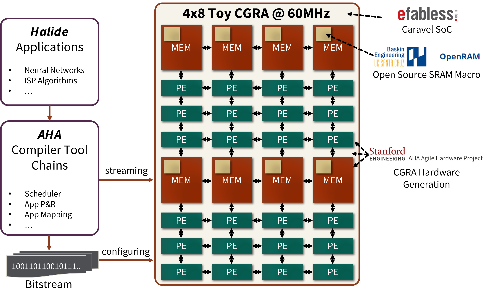
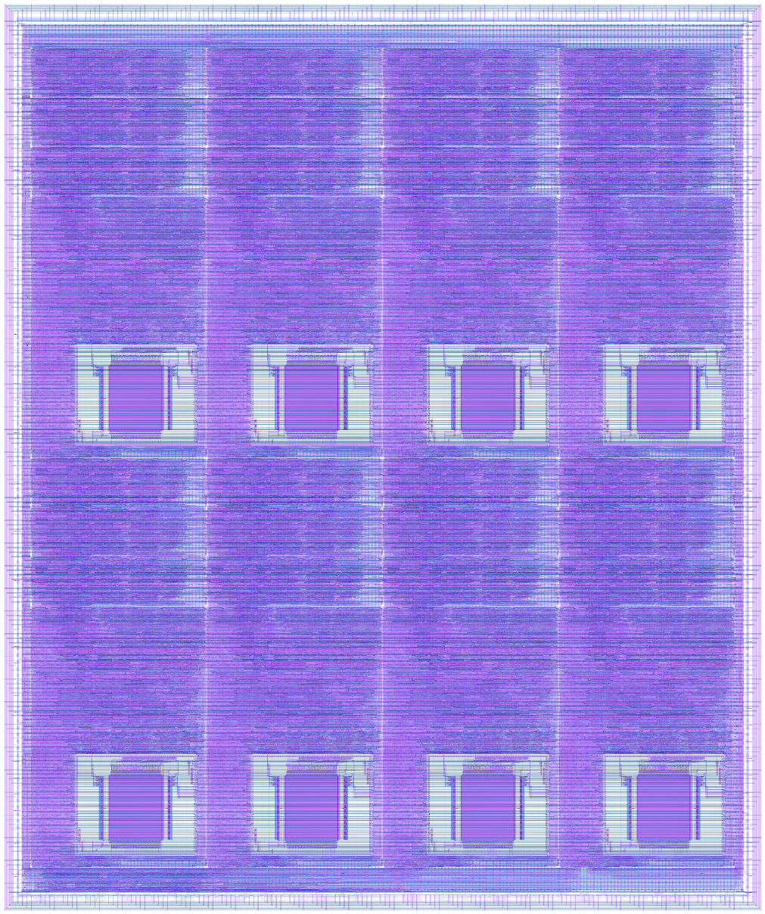

# EE272B Toy CGRA

## Table of contents
- [Overview](#overview)
- [Halide Applications](#halide-applications)
- [AHA Compiler Tool Chains](#aha-compiler-tool-chains)
- [CGRA Architecture](#cgra-architecture)
- [Layout](#layout)
- [Future Work](#future-work)
- [Special Thanks](#special-thanks)
- [Contributors](#contributors)

## Overview

This project realized a 4x8 toy CGRA (Coarsed Grained Reconfigurable Array) modified from the [Garnet chip](https://github.com/StanfordAHA/garnet) from [Stanford Agile Hardware Project](https://aha.stanford.edu/). Its enables hardware acceleration on applications (such as deep neural networks, image signal processing algorithms...) written in [Halide](https://halide-lang.org/). Comparing to FPGA, it provides faster configuration time and lower power consumption. Comparing to ASIC, it shows better flexibility because its reconfigurability. At signoff stage, our toy CGRA runs at 66MHz takes the area around 3.5mm x 2.9mm.

## Halide Applications
Halide is an programming language that targets high performance array processing algorithms. It decouples the computation and scheduling of the algorithm. We first write our applicaions in Halide and send it through AHA compiler toolchains to map it to our CGRA. For more information please visit https://halide-lang.org/

## AHA Compiler Tool Chains
--under-construction--

## CGRA Architecture
--under-construction--

## Layout

## Future Work
The original goal of this project is to design a CGRA with specialized processing elements (PEs). However, due to very limited amount of time, we are only able to finish the baseline version. In future works, we aim at designing PEs that are specilized in MAC (multiply-and-add) so that we can have a CGRA that is less flexible in other applications but has higher performance in applications that are mainly composed of MACs (such as neural networks).

## Special Thanks
* Professor Priyanka Raina: for offering this opportunity and countless advises during the tape-out.
* Members of Stanford AHA Group (Keyi, Max, Joey, Alex, and many other students): for giving lots of suggestions on both the hardware generation part and physical design part.
* Professor Matthew Guthaus: for developing the openRAM macro that are free for anyone to use.
* People from efabless: for helping with the caravel SoC integration.

## Contributors
* [Charles Tsao @(chtsao8)](https://github.com/chtsao8)
* [Po-Han Chen @(pohantw)](https://github.com/pohantw)
